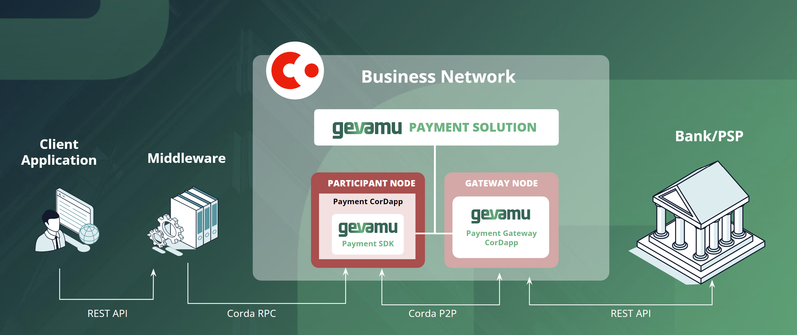

# corda-payments-sdk

## Gevamu Payments Solution

[Gevamu (from Sinhala: ගෙවමු – *Let’s pay*) Payments Solution](https://gevamu.com/), developed by [Exactpro](https://exactpro.com/) based on [R3 Corda](https://www.r3.com/products/corda/), is aimed at fund distribution between a payer (the Participant) and a Payment Service Provider (PSP).

### Functionality

The solution allows the Participant to initiate a payment flow by calling the Gevamu Payments SDK implemented in a custom Payments CorDapp installed on their node in a Corda Business Network.

A payment instruction submitted by the Participant as a document formatted according to a payment standard (e.g. ISO 20022) is consumed by the Payments CorDapp and passed through the Gevamu Gateway implemented as another CorDapp installed on the Corda node within the same business network.

The Gevamu Gateway acts as an authorized end-point connected to the payment gateway on the side of the PSP and transfers the payment instruction received from the Participant on-chain to the PSP located off-chain. The Gevamu Payments solution manages the payment flow. As part of the flow, it creates Corda states and updates them based on responses received by the Payment Gateway from the PSP. Payment status updates are communicated back to the Participant.

### Structure

The solution consists of a payments SDK and a payment gateway, which are to be deployed in a Corda business network managed by a Corda Business Network Operator (BNO):

- **Gevamu  Payments SDK**: a Java/Kotlin library containing classes and methods used by the payment workflow. The SDK’s functionality is the core part of a custom CorDapp developed by the BNO or a third party and installed on the Participant’s node in a Corda business network operated by the BNO.

  Gevamu Payments SDK is distributed as an open-source software under Apache-2.0 License. Its source code is [available on GitHub](https://github.com/gevamu/corda-payments-sdk). <!-- Binaries are to be published in a Central Maven Repository. -->

- **Gevamu Payment Gateway**: a CorDapp managing on-chain payment flows initiated by the Participant through the Gevamu Payments SDK and communicating with an off-chain payment service provider gateway to pass payment instructions and receive payment status updates.

  Gevamu Payments Gateway is proprietary technology licensed by Exactpro.

The Gevamu Payments SDK and Payments Gateway are developed based on R3 Corda 4.x.

System requirements of the implementation depend on the scope of a final system.
For hardware and software requirements for development on Corda, see official [R3 documentation](https://docs.r3.com/en/platform/corda/4.8/open-source/getting-set-up.html).

### Application example

While the scope of the Gevamu payments solution comprises two components – the Payments SDK and Payments Gateway, – it is expected to be used as a part of solutions spanning various use cases.

Potential use cases for the Gevamu payments solution include but are not limited to:
- payment infrastructures
- exchanges and central counterparties
- DLT-based and hybrid platforms
- financial standards and protocols
- asset classes: fiat, digital assets (including CBDCs and NFTs)

The diagram below illustrates a use case of Gevamu Payments solution being integrated into a hybrid DLT/non-DLT payments ecosystem.



In the sample configuration proposed on the diagram, the Gevamu payments solution (Payments SDK and Payments Gateway) interacts with the following components:

- **Client Application**  
    Most typically, the Client Application is a Web UI or a mobile application on a user’s machine. It is developed by the Participant/BNO organization and customized according to their needs. By filling out a payment form in the Client Application’s UI, the Participant specifies necessary information about the payment and triggers the payment initiation process that is subsequently to be handled by the Gevamu Payments SDK and Payments Gateway’s Corda flows.

- **Middleware**  
    Middleware is a backend to enable communication between the Client Application and the Participant Node in the Corda Network. The payment data specified by the Participant through the Client Application is processed and sent to the Payments CorDapp to be translated into the payment instruction by the Gevamu Payments SDK. The middleware is developed by the Participant/BNO.

    > A sample Client Application UI along with middleware is developed by Exactpro. In this implementation, the middleware communicates with the Client Application via REST API; its communication with the Payments CorDapp is done via Corda RPC. The source code of both sample components is available as a [supplementary part of the Payments SDK](https://github.com/gevamu/corda-payments-sdk/tree/master/payments-app-sample).

- **Corda network**  
    Corda network is a publicly-available internet of Corda nodes operated by network participants. Its subset (business network) is managed by the BNO. In the context of the payment solution described here, such a network hosts the Corda nodes where both parts of the Gevamu solution are deployed as CorDapps.

- **Participant node**  
    A node in the Corda business network with the Payments CorDapp installed on it

- **Payments CorDapp**  
  A custom CorDapp developed by the Participant or the BNO using the Gevamu Payments SDK

- **Gateway node**  
    The Gateway node is a node in the Corda business network where the Gevamu Payments Gateway is installed as a CorDapp. The Gateway node communicates on-chain with the Participant’s CorDapp based on the Gevamu Payments SDK via a proprietary API; the connection with the PSP is off-chain.
    
    > To simplify the development of a custom Payments CorDapp in the absence of the Gevamu Payments Gateway license, a payments gateway stub is developed by Exactpro and available as a supplementary to the Gevamu Payments SDK.

- PSP payments gateway
  An endpoint of a proprietary off-chain payments solution on the PSP side

## Installation

TODO: publish package and describe

## Usage

### Create service class

```java
// Model for RegisterParticipantFlow result
import com.gevamu.corda.flows.ParticipantRegistration;
// Flow for participant registration
import com.gevamu.corda.flows.RegisterParticipantFlow;

// Flow payment execution
import com.gevamu.corda.flows.PaymentFlow;
// Model for PaymentFlow input
import com.gevamu.corda.flows.PaymentInstruction;
// Model of payment
import com.gevamu.corda.states.Payment;
```

```java
class PaymentService {
    private static final String GATEWAY_PARTY_NAME = "Gateway";
    private static final String PAYMENT_INSTRUCTION_ATTACHMENT = "paymentInstruction.xml";

    private transient CordaRPCConnection connection;
    private transient CordaRPCOps proxy;
    
    public setup(
            String host,    // Corda node host 
            Integer port,   // Corda node port 
            String user,    // RPC user 
            String password // RPC user password 
    ) {
        NetworkHostAndPort networkAddress = new NetworkHostAndPort(host, port);
        CordaRPCClient client = new CordaRPCClient(networkAddress);
        connection = client.start(user, password);
        proxy = connection.getProxy();
    }

    public CompletionStage<Void> executePaymentFlow(@NonNull PaymentInstruction paymentInstruction) {
        Party gatewayParty = getParty(GATEWAY_PARTY_NAME);
        return proxy.startFlowDynamic(PaymentFlow.class, paymentInstruction, gatewayParty)
                .getReturnValue()
                .toCompletableFuture()
                .thenApply(it -> null);
    }

    public CompletionStage<ParticipantRegistration> executeRegistrationFlow() {
        Party gatewayParty = getParty(GATEWAY_PARTY_NAME);
        return proxy.startFlowDynamic(RegisterParticipantFlow.class, gatewayParty)
                .getReturnValue()
                .toCompletableFuture();
    }

    public List<StateAndRef<Payment>> getPayments() {
        return proxy.vaultQuery(Payment.class)
                .getStates();
    }
}
```

### Register corda node

```java
class Main {
    public static void main(String[] args) {
        PaymentService service = new PaymentService();
        service.setup("localhost", 10012, "user", "password");
        
        service.executeRegistrationFlow();
    }
}
```

### Execute payment

```java
class Main {
    public static void main(String[] args) {
        PaymentService service = new PaymentService();
        service.setup("localhost", 10012, "user", "password");
        
        PaymentInstruction paymentInstruction = new PaymentInstruction(
                PaymentInstructionFormat.ISO20022_V9_XML_UTF8,
                byteArray // Payment instruction in specified format cast to ByteArray 
        );
        service.executePaymentFlow(paymentInstruction);
    }
}
```

### Get list of payments

```java
class Main {
    public static void main(String[] args) {
        PaymentService service = new PaymentService();
        service.setup("localhost", 10012, "user", "password");

        List<StateAndRef<Payment>> payments = service.getPayments();
    }
}
```
